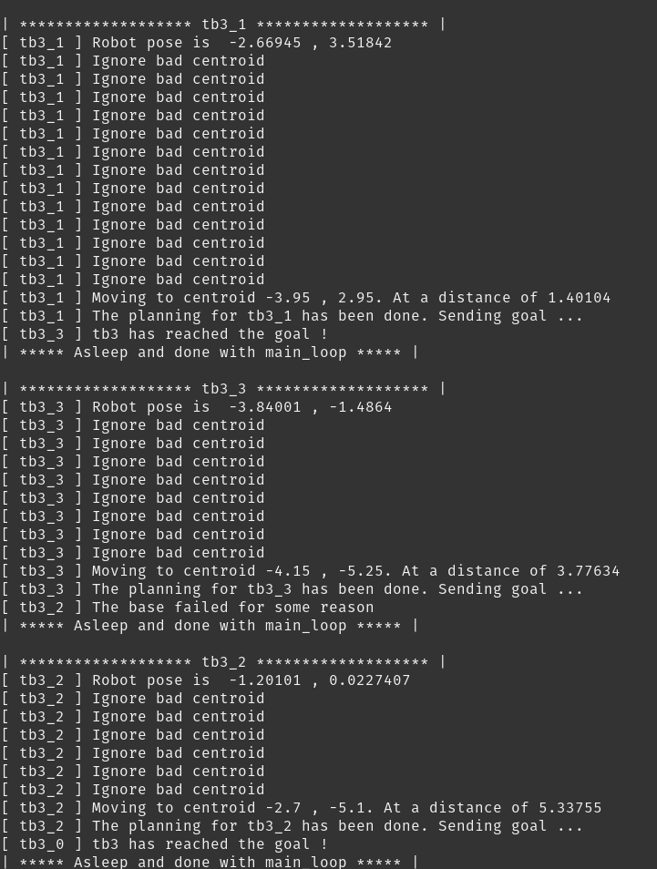
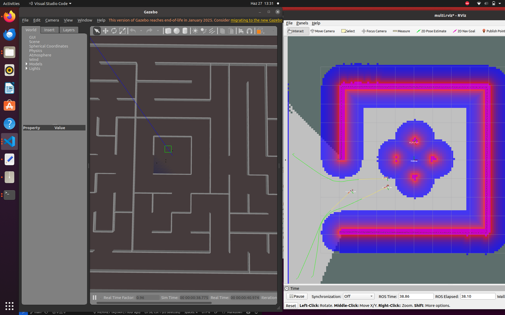
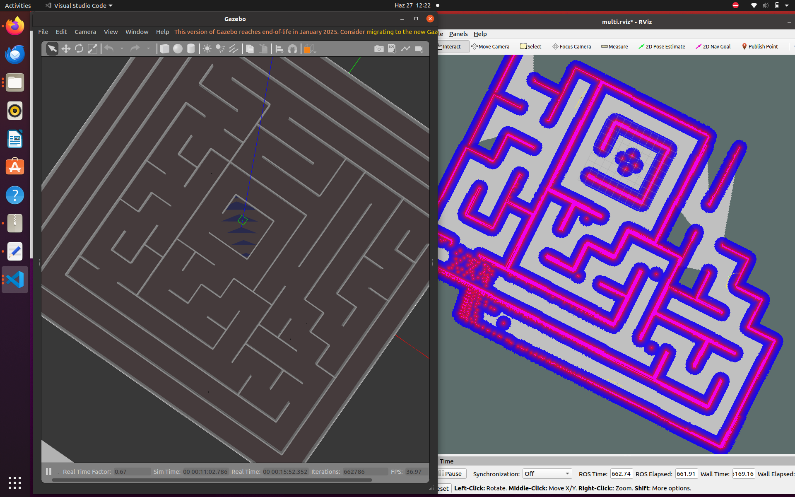

# multi-tb3-frontier-explore

## Project Description

This project implements a **multi-robot frontier exploration** system using **four TurtleBot3 (burger model)** robots in a **ROS1 Noetic** environment. Each robot performs SLAM with `gmapping`, shares maps using `multirobot_map_merge`, and explores the environment using a custom **frontier-based planner** node.

---

## 🧱 Repository Structure & Setup

### 1. Install necessary packages

```bash
sudo apt-get install ros-noetic-multirobot-map-merge
```

### 2. Clone this repository and dependencies

```bash
mkdir -p ~/robotlar_ws/src
cd ~/robotlar_ws/src

# This repository
git clone https://github.com/tastangh/ros-multi-turtlebot-frontier-exploration.git

# TurtleBot3 core repos
git clone https://github.com/ROBOTIS-GIT/turtlebot3.git
git clone https://github.com/ROBOTIS-GIT/turtlebot3_simulations.git

cd ~/robotlar_ws
rosdep install --from-paths src --ignore-src -r -y
catkin_make
```

### 3. Update `.bashrc`

```bash
echo "source ~/robotlar_ws/devel/setup.bash" >> ~/.bashrc
echo "export TURTLEBOT3_MODEL=burger" >> ~/.bashrc
source ~/.bashrc
```

---

## 🚀 Launch Simulation

Start the simulation and visualization tools:

```bash
roslaunch micromouse_maze micromouse_maze3_multi.launch
roslaunch turtlebot3_gazebo multi_map_merge.launch
roslaunch turtlebot3_gazebo multi_turtlebot3_slam.launch
roslaunch turtlebot3_navigation multi_move_base.launch
roslaunch micromouse_maze multi_robot_rviz.launch
```

---

## 🧠 Start Frontier Exploration Node

```bash
rosrun multirobot_exploration_mapping frontier_explorer_node
```

---

## 🛠️ How the Frontier Explorer Works

### Steps:

1. **Map Listening**  
   Subscribes to `/map` and extracts unexplored boundary regions (frontiers).

2. **Region Detection**  
   Segments border edges and computes centroids of reachable frontiers.

3. **Robot State Tracking**  
   Uses TF to locate each robot's pose with respect to the map frame.

4. **Target Assignment**  
   Assigns each robot to the nearest frontier point based on its position.

5. **Goal Sending & Monitoring**  
   Sends `move_base` goals and tracks completion using `actionlib`.

6. **Failure Recovery**  
   If the robot gets stuck or fails to reach, a new goal is automatically sent.

---

## 📷 Visual Results

### Console Output


### Initial Exploration State


### Exploration Progress


### TF Tree


---

## ✅ Conclusion

This project demonstrates the integration of:
- multi-robot SLAM
- map merging
- autonomous frontier detection
- ROS action-based goal planning

The system is robust to failed goals and dynamically assigns new targets in a decentralized fashion.

---

### 👤 Developed for:
**BLM6191 - Robotlar Dersi**  
**Yıldız Teknik Üniversitesi, 2025 Final Projesi**
